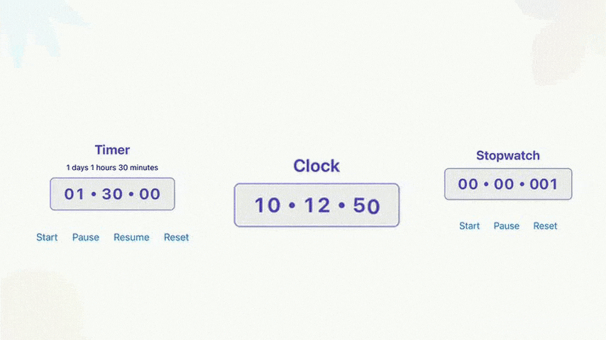

# React Native Reanimated Chrono

[](https://www.npmjs.com/package/react-native-reanimated-chrono) [](https://expo.io/) [](https://www.npmjs.com/package/react-native-reanimated-chrono)
[](https://www.npmjs.com/package/react-native-reanimated-chrono)

A Reanimated-powered library for creating smooth and customizable timers, stopwatches, and time displays in React Native. ⏳



## Features

- 🧩 **Highly Composible** - All components — Timer, Stopwatch, and Clock — are now fully composable.
- ⚡ **High Performance** – Achieves smooth 60FPS animations using Reanimated
- 🎨 **Fully Customizable** – Configure behavior, appearance, and animations via flexible props
- 🎞️ **Built-in Entry & Exit Animations** – Seamlessly integrate with Reanimated transitions
- 🧩 **Powered by Reanimated v3** – Utilizes the latest version for optimal performance and capabilities
- 🎨 Support Classnames
- 🚀 **Expo-Compatible** – Works out of the box with managed Expo projects
- ✨ **TypeScript First**– Fully typed for better DX and safer code

## Components

- **Timer** – Countdown timer with customizable duration, animations, and callbacks. [Check it out](#timer)
- **Stopwatch** – Accurate stopwatch with start, pause, and reset controls. [Check it out](#stopwatch)
- **Digital Clock** – Live clock display showing current time, updated in real-time. [Check it out](#clock)

## Composability

All components — Timer, Stopwatch, and Clock — are now fully composable.

They share a common set of time unit segments:
Day, Hour, Minute, Second, and Millisecond.

This means you have full control over how time is displayed and animated.
You can mix and match these building blocks to create custom layouts, animations, and styles that fit your app perfectly.

Example

```tsx
import { Timer } from '@doclabs/react-native-reanimated-timer';

export default function App() {
  return (
    <Timer durationMs={60000}>
      <Timer.Minute />
      <Timer.Second />
      <Timer.Millisecond />
    </Timer>
  );
}
```

You can also use the same composable structure with the Stopwatch and Clock components:

```tsx
<Stopwatch autoStart>
  <Stopwatch.Hour />
  <Stopwatch.Minute />
  <Stopwatch.Second />
</Stopwatch>

<Clock format="12">
  <Clock.Hour />
  <Clock.Minute />
  <Clock.Second />
</Clock>
```

Why Composability?

This design enables:

- 🧱 Maximum Flexibility – Use only the units you need (Minute, Second, etc.).
- 🎨 Full Customization – Add your own separators, labels, or styles between units.
- ⚙️ Consistency – All unit components share a consistent API across Timer, Stopwatch, and Clock.
- 🔄 Interchangeability – Swap components easily without changing the surrounding layout or logic.

Each component (Timer, Stopwatch, Clock) manages its own internal timing logic while exposing shared subcomponents for complete composability and freedom of use.

[Learn more](#segments)

## Acknowledgements

- 🙏 **Component and Animation Inspiration**  
  This library is heavily inspired by [`react-native-animated-stopwatch-timer`](https://github.com/rgommezz/react-native-animated-stopwatch-timer) and the accompanying blog. It’s a great resource for understanding animation patterns with Reanimated—highly recommended!

- 🧠 **Custom Hook Design**  
  The internal time management logic draws inspiration from [`react-timer-hook`](https://github.com/amrlabib/react-timer-hook). Chose not to use it as a direct dependency to allow for more fine-grained control and customization.  
  If you're only looking for a headless timekeeping hook (without UI), definitely consider using `react-timer-hook` directly.

### Installation

```sh
npm install @doclabs/react-native-reanimated-timer
```

> Note: This package is built on top of [react-native-reanimated](https://docs.swmansion.com/react-native-reanimated/), so make sure it’s properly installed and configured in your project.
> Refer to the [Reanimated installation guide](https://docs.swmansion.com/react-native-reanimated/docs/fundamentals/getting-started) if you haven’t already set it up.

## Usage

[Check out this example Snack](https://snack.expo.dev/@docren155/react-native-reanimated-chrono)

## Timer

Timer component that counts down from a specified duration.

### Props

| Prop       | Type       | Default   | Description                                            |
| ---------- | ---------- | --------- | ------------------------------------------------------ |
| durationMs | number     | -         | `Required` The duration in milliseconds for the timer. |
| intervalMs | number     | 1000      | The interval in milliseconds to update the timer.      |
| autoStart  | boolean    | true      | Whether to start the timer automatically.              |
| onExpire   | () => void | undefined | Callback function to be called when the timer expires. |

For additional props, refer to the [Common Props](#common-props) section.

### Methods

#### `start: () => void;`

Starts the timer if it is not already running or paused.

```ts
timerRef.current?.start();
```

#### `pause: () => void;`

Pauses the timer if it is running.

```ts
timerRef.current?.pause();
```

#### `resume: () => void;`

Resumes the timer if it is paused.

```ts
timerRef.current?.resume();
```

#### `restart: (duration: number; autoStart?: boolean) => void;`

Restarts the timer with a new duration and optional autoStart value.

- duration - The new duration in milliseconds.
- autoStart - Whether to start the timer automatically. Optional, Defaults to true

```ts
timerRef.current?.restart(1800000, false); // Timer for 30 mins, with autoStart set to false
```

#### ` reset: () => void;`

Resets the timer to the initial duration and intial autoStart value.

```ts
timerRef.current?.reset();
```

## Stopwatch

### Props

| Prop            | Type    | Default   | Description                                           |
| --------------- | ------- | --------- | ----------------------------------------------------- |
| autoStart       | boolean | false     | Whether to start the stopwatch automatically.         |
| intervalMs      | number  | 1000      | The interval in milliseconds to update the stopwatch. |
| offsetTimestamp | Date    | undefined | The offset timestamp to start the stopwatch from.     |

For additional props, refer to the [Common Props](#common-props) section.

### Methods

#### `start: () => void;`

Starts the stopwatch

```ts
timerRef.current?.start();
```

#### `pause: () => void;`

Pauses the stopwatch

```ts
timerRef.current?.pause();
```

#### `reset: (autoStart?: boolean, offset?: Date) => void;`

Resets the stopwatch with a new offset and autoStart value.

- autoStart - Whether to start the timer automatically. Optional, Defaults to false
- offset - The offset date to set the stopwatch to. Optional, Defaults to undefined

```ts
timerRef.current?.restart();
```

## Clock

Clock component to display the current time.

- It can be configured to show hours, minutes, seconds, and milliseconds.
- The time format can be set to either 12-hour or 24-hour format.

### Props

| Prop       | Type         | Default | Description                                       |
| ---------- | ------------ | ------- | ------------------------------------------------- |
| format     | '12' \| '24' | '24'    | The time format to be used.                       |
| intervalMs | number       | 1000    | The interval in milliseconds to update the clock. |

For additional props, refer to the [Common Props](#common-props) section.

## Common Props

> All common props are optional

| Prop                    | Type                  | Default   | Description                                                                                                                                            |
| ----------------------- | --------------------- | --------- | ------------------------------------------------------------------------------------------------------------------------------------------------------ |
| animationDelay          | number                | 0         | Delay before the animation starts (in milliseconds).                                                                                                   |
| animationDuration       | number                | 80        | Duration of the animation (in milliseconds).                                                                                                           |
| animationDistance       | number                | 1200      | Distance the animation moves.                                                                                                                          |
| animationDirection      | 'up' \| 'down'        | 'down'    | Direction of the animation ('up' or 'down').                                                                                                           |
| entering                | EntryOrExitLayoutType | undefined | Custom entering animation from [react-native-reanimated](https://docs.swmansion.com/react-native-reanimated/docs/layout-animations/custom-animations). |
| exiting                 | EntryOrExitLayoutType | undefined | Custom exiting animation from [react-native-reanimated](https://docs.swmansion.com/react-native-reanimated/docs/layout-animations/custom-animations) . |
| skipEntering            | boolean               | true      | Useful for preventing initial animation on mount.                                                                                                      |
| skipExiting             | boolean               | false     | Useful for preventing exit animation on unmount.                                                                                                       |
| style                   | ViewStyle             | undefined | Style for grouped digit's container. eg: [tens of seconds, units of seconds]                                                                           |
| className               | string                | undefined | Styling for component                                                                                                                                  |
| digitContainerStyle     | ViewStyle             | undefined | Style for grouped digit's container. eg: [tens of seconds, units of seconds]                                                                           |
| digitContainerClassName | string                | undefined | Styling for digit's container                                                                                                                          |
| digitStyle              | TextStyle             | undefined | Style for the individual digits, eg: Tens of seconds                                                                                                   |
| digitClassName          | string                | undefined | Styling the individual digits                                                                                                                          |

## Segments

- **Day** (Not available for Clock)
- **Hour**
- **Minute**
- **Second**
- **Millisecond**
- **AMPM** (avaible only in Clock)

| Prop           | Type      | Default   | Description              |
| -------------- | --------- | --------- | ------------------------ |
| className      | string    | undefined | styling for the segment  |
| style          | ViewStyle | undefined | styling for the segement |
| digitClassName | string    | undefined | styling for the digits   |
| digitStyle     | TextStyle | undefined | styling for the digits   |

> Even though digit(Style/className) is provided here, it is preferred to use the digitStyle at the root level to ensure a common styling thru all segments

## Related

- [react-timer-hook](https://github.com/amrlabib/react-timer-hook)
- [react-native-animated-stopwatch-timer](https://github.com/rgommezz/react-native-animated-stopwatch-timer)

## Contributing

See the [contributing guide](CONTRIBUTING.md) to learn how to contribute to the repository and the development workflow.

## License

This project is licensed under the MIT License.

[MIT](./LICENSE)

## Authors

- [amilmohd155](https://www.github.com/amilmohd155)

## Built with ❤️

- [react-native-reanimated](https://github.com/software-mansion/react-native-reanimated)
- [react-native-builder-bob](https://github.com/callstack/react-native-builder-bob)
